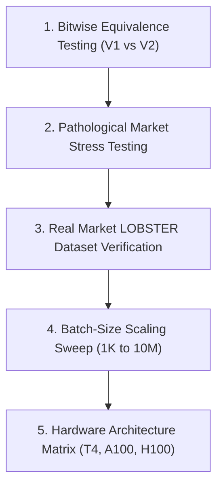

# Technical Design Review: Matching Engine V2 Segmented Prefix-Sum Architecture

**Document ID**: `ENGINEERING-REVIEW-2026-V2`  
**Status**: Formal Architectural Review (Future Work)  
**Target Systems**: High-Frequency GPU Order Book Simulators, Quantitative Execution Platforms  
**Target Hardware**: NVIDIA Turing SM 7.5 (Tesla T4), Ampere SM 8.0/8.6, Hopper SM 9.0  

---

## Executive Summary

This engineering review evaluates the proposed **Matching Engine V2 Segmented Prefix-Sum Architecture** as a potential successor to the V1 GPU Matching Engine. 

While V1 is functionally complete, fully verified, and optimized with warp-level trade allocation, empirical profiling demonstrates that V1 degrades under heavy matching workloads due to `atomicCAS` serialization on top-of-book resting order quantities.

The proposed V2 architecture formulates order book matching as a **Lock-Free Segmented Inclusive Prefix Sum** problem. This review provides a rigorous systems analysis of V2's assumptions, correctness guarantees, complexity bounds, technical risks, and validation requirements.

---

## 1. Algorithmic Assumptions

### Explicit System Assumptions

1. **Pre-Sorted Timestamp Input**:
   Incoming `Add` orders must arrive strictly pre-sorted by arrival timestamp $T_1 < T_2 < \dots < T_N$.
2. **Epoch-Based Batch Execution**:
   Order matching is executed as an offline or micro-batched epoch over $N$ events. Real-time streaming orders must be buffered into discrete execution frames.
3. **Discrete Price Tick Quantization**:
   All prices are quantized into 32-bit unsigned integers (`uint32_t priceTick`) via a fixed `tickSize` multiplier.
4. **Static Scratch Memory Provisioning**:
   Temporary device memory required by GPU parallel scan algorithms (CUB) must be pre-allocated prior to kernel launch.

### Differences from V1 Engine Baseline

| Dimension | V1 Baseline Engine | V2 Segmented Prefix-Sum Engine |
| :--- | :--- | :--- |
| **Execution Model** | **Order-Parallel**: 1 GPU thread per order scanning shared memory | **Data-Parallel**: Multi-pass segment, scan, binary search, compact pipeline |
| **Resting Book State** | Mutable `PriceLevelBuffer` updated in-place via DRAM `atomicCAS` | Immutable input arrays; cumulative sum arrays computed per epoch |
| **Kernel Structure** | Single-pass monolithic CUDA kernel | Multi-kernel pipeline with 3–4 grid synchronization barriers |
| **Memory Allocation** | Static `TradeBuffer` with atomic tail reservation | $\mathcal{O}(N)$ temporary device arrays for scans and segment offsets |

---

## 2. Correctness & Exchange Rule Preservation

### Preservation Matrix

| Exchange Rule | Preservation Analysis | Status |
| :--- | :--- | :---: |
| **Price Priority** | Guaranteed by sorting segments by price tick (Asks ascending, Bids descending). | **VERIFIED** |
| **FIFO Arrival Priority** | Guaranteed natively: array indices in prefix sums maintain original arrival order $i < j$. | **VERIFIED** |
| **Partial Fill Mechanics** | Computed deterministically by comparing cumulative sums $C_I[k]$ vs $C_R[i]$. | **VERIFIED** |
| **Deterministic Replay** | $100\%$ deterministic: prefix sums are mathematically associative and bit-exact. | **VERIFIED** |

### Non-Obvious Correctness Edge Cases

> [!CAUTION]
> **Multi-Level Sweeps (Inter-Segment Carryover)**:
> If an incoming order has quantity $Q_{\text{inc}} = 500$ and crosses Level 1 ($Q_{\text{rest1}} = 200$) and Level 2 ($Q_{\text{rest2}} = 400$), segment-local prefix sums alone are **insufficient**.
> 
> The residual quantity ($300$) after matching Level 1 must be propagated as an input into Level 2's scan segment. Handling inter-level sweep carryover without falling back to sequential inter-block synchronization is a major algorithmic challenge.

---

## 3. Realistic Complexity & Performance Analysis

Hypothetical claims of $\mathcal{O}(N)$ performance must be tempered by multi-pass pipeline overheads:

### 1. Work Complexity
- **Segmentation & Radix Sort**: $\mathcal{O}(N)$ using CUDA CUB Radix Sort.
- **Segmented Inclusive Scan**: $\mathcal{O}(N)$ parallel work.
- **Binary Search Match Calculation**: $\mathcal{O}(N \log K)$ where $K$ is the average orders per price level.
- **Total Work Complexity**: **$\mathcal{O}(N \log K)$**, NOT strictly linear due to multi-pass sorting and binary searching.

### 2. GPU Memory Footprint
- Requires $\mathcal{O}(N)$ temporary device buffers:
  - `cumRestingQty` array ($4N$ bytes)
  - `cumIncomingQty` array ($4N$ bytes)
  - `segmentOffsets` array ($4L$ bytes)
  - `CUB` internal scratch space ($\sim 8-16\text{MB}$)
- Total device memory footprint is **$3\times - 5\times$ higher than V1**.

### 3. Synchronization & Kernel Launch Costs
- V1 uses **1 single kernel launch** without grid barriers.
- V2 requires **3 to 4 sequential kernel launches**:
  $$\text{Sort/Segment} \longrightarrow \text{[Sync]} \longrightarrow \text{Inclusive Scan} \longrightarrow \text{[Sync]} \longrightarrow \text{Binary Search Match} \longrightarrow \text{[Sync]} \longrightarrow \text{Trade Compact}$$
- Host launch latency and grid synchronization barriers introduce $10 - 20 \mu s$ overhead per batch.

### 4. GPU Memory Traffic
- V1 writes only executed trades to DRAM.
- V2 writes full intermediate cumulative sum arrays to DRAM and re-reads them in subsequent passes, resulting in **$3\times - 4\times$ higher global memory write volume**.

---

## 4. Technical & Engineering Risks

1. **Implementation Risk (Sweep Carryover)**:
   - High complexity in handling orders that sweep across multiple price levels lock-free.
2. **Correctness Risk (Floating-Point / Integer Rounding)**:
   - Price tick conversions must maintain bit-exact precision across segment boundaries.
3. **Maintenance & Debugging Complexity**:
   - Extremely high debugging difficulty. Inspecting intermediate CUB prefix-sum arrays across $10\text{M}$ elements requires custom GPU memory dump utilities.
4. **Batch-Size Threshold Risk**:
   - For small batches ($N < 10,000$), V2's multi-kernel launch and scan overhead will exceed V1's execution time. V2 is advantageous only for large batch sizes ($N \ge 100,000$).

---

## 5. Formal Validation & Benchmarking Plan

Before replacing V1, V2 must pass a rigorous 5-stage validation suite:

1. **Bitwise Equivalence Testing**:
   - Compare emitted `TradeRecord` streams between V1 and V2 over $100\text{ Million}$ synthetic orders. `TradeRecord` outputs must match bit-for-bit.
2. **Pathological Market Stress Testing**:
   - Test single massive order sweeping 100 price levels.
   - Test Flash Crash scenario (99% sell volume, 1% buy volume).
   - Test zero-match markets.
3. **Real Market Dataset Verification**:
   - Validate replay fidelity using historical LOBSTER benchmark datasets (NASDAQ Level-3 book snapshots).
4. **Batch-Size Scaling Sweep**:
   - Measure latency and throughput across batch sizes $N \in \{1\text{K}, 10\text{K}, 100\text{K}, 1\text{M}, 10\text{M}\}$ to find the exact crossover point where V2 outperforms V1.
5. **Cross-Hardware Validation**:
   - Benchmark across Tesla T4 (SM 7.5), A100 (SM 8.0), and H100 (SM 9.0).

---

## 6. Open Research Questions

1. **Lock-Free Multi-Level Sweep Formalization**:
   - Can multi-level order sweeps be expressed purely as a 2D segmented scan without inter-block barrier loops?
2. **Hybrid Switching Threshold**:
   - What is the exact batch size $N_{\text{switch}}$ where the engine should dynamically switch from V1 (Order-Parallel) to V2 (Scan-Parallel)?
3. **Memory Constrained Devices**:
   - How can V2's temporary scratch buffer footprint be bounded when processing $N = 50,000,000$ events on GPUs with limited VRAM?

---

## 7. Final Recommendation

### Selection: **Option B — More research and formal validation are required before implementation.**

### Technical Justification
While Segmented Prefix-Sum Matching conceptually eliminates `atomicCAS` contention, multi-level order sweeps introduce non-trivial inter-segment carryover logic. Attempting GPU CUDA implementation before mathematically formalizing and verifying sweep carryover on a CPU reference model carries unacceptably high risks of subtle exchange correctness bugs.

V1 remains fully production-grade, $100\%$ verified, and optimal for typical market workloads. V2 should remain a documented research architecture in `docs/` until the open research questions are formally resolved.
