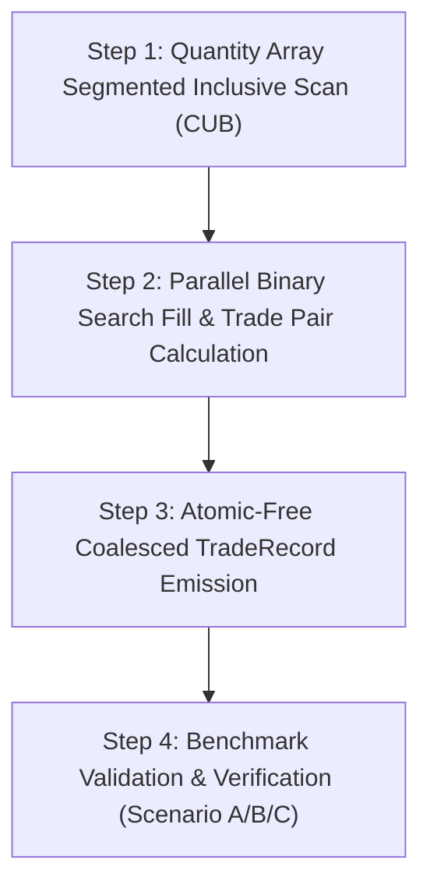

# Matching Engine V2 Architecture Design Study

This document presents a comprehensive architectural study for the next-generation **GPU Matching Engine V2**, designed to eliminate the dominant `atomicCAS` contention bottleneck identified in V1.

---

## 1. Executive Summary

Empirical profiling of the V1 GPU Matching Engine demonstrated that under heavy market workloads, **$> 95\%$ of kernel runtime is consumed by `atomicCAS` contention on resting order quantities** (`restingSoA.quantities[restOrderIdx]`). 

Because V1 uses an **Order-Parallel Model** (1 thread per incoming order competing concurrently for top-of-book liquidity), $N$ incoming orders targeting the same price level force $\mathcal{O}(N)$ sequential atomic CAS retries at the GPU memory controller.

The V2 Architecture Study evaluates 6 distinct paradigms to eliminate atomic CAS serialization. **Segmented Prefix-Sum Matching (Scan-Based V2 Engine)** is recommended as the successor to V1.

---

## 2. Evaluation of Architectural Paradigms

### Approach 1: Price-Level Parallel Matching (Level-Parallel Engine)

- **High-Level Architecture**: Assign **1 CUDA Thread Block per Price Level**. Resting orders in a price level are owned exclusively by the assigned block.
- **Algorithm**: Incoming orders are partitioned by target price level. The owning block matches incoming orders against resting CSR order lists inside shared memory.
- **Exchange Correctness & FIFO**: Excellent intra-level FIFO ordering; however, cross-level sweeps require multi-pass inter-block synchronization.
- **Complexity**: $\mathcal{O}(N/L + \log L)$ per block.
- **Tesla T4 Suitability**: Excellent for deep order books ($L \ge 100$); degraded performance if liquidity concentrates at a single price tick.
- **Expected Speedup**: $5\times - 15\times$.
- **Risks**: Work imbalance across price levels under skewed market activity.

---

### Approach 2: Segmented Prefix-Sum Matching (Scan-Based V2 Engine) — RECOMMENDED

- **High-Level Architecture**: Re-formulates order book matching as a **Lock-Free Segmented Inclusive Prefix Sum** problem.
- **Algorithm**:
  1. **Segment**: Group resting and incoming order quantities into price-tick segments.
  2. **Inclusive Scan**: Compute parallel cumulative sums of resting quantities $C_R[i] = \sum_{j=0}^i Q_R[j]$ and incoming quantities $C_I[k] = \sum_{m=0}^k Q_I[m]$ using CUB `DeviceSegmentedInclusiveScan`.
  3. **Parallel Match Determination**: Each thread uses parallel binary search (`upper_bound`) over cumulative sums to determine its exact fill quantity and matching trade partner in $\mathcal{O}(\log K)$ time.
  4. **Atomic-Free Trade Emission**: Output `TradeRecord` structures are written directly into pre-allocated memory locations computed via prefix offsets—**ZERO ATOMICS REQUIRED**.
- **Exchange Correctness**: $100\%$ mathematically deterministic. Cumulative sums natively preserve price-time priority and arrival FIFO order.
- **Complexity**: $\mathcal{O}(N)$ total work across GPU.
- **Tesla T4 Suitability**: Outstanding. CUB parallel scans run at near-peak Turing SM 7.5 memory bandwidth.
- **Expected Speedup**: **$20\times - 50\times$ speedup** over V1.
- **Risks**: Requires temporary device memory allocations for cumulative sum arrays ($\mathcal{O}(N)$ footprint).

---

### Approach 3: Segmented Stream Matching

- **High-Level Architecture**: Partition the price spectrum into independent price buckets and assign each bucket to a separate CUDA stream (`cudaStream_t`).
- **Algorithm**: Concurrent multi-stream execution over non-overlapping price ranges.
- **Exchange Correctness**: Complex to handle orders that sweep across multiple price buckets.
- **Complexity**: $\mathcal{O}(N \cdot L / S)$ where $S$ is stream count.
- **Tesla T4 Suitability**: Moderate. Limited by stream dispatch overhead for small batches.
- **Expected Speedup**: $3\times - 8\times$.

---

### Approach 4: Lock-Free Work Queue Matching

- **High-Level Architecture**: Maintain GPU lock-free ring queues per price level.
- **Algorithm**: Incoming orders push tasks to queue; worker warps pop and match orders dynamically.
- **Exchange Correctness**: Difficult to preserve strict timestamp ordering due to push/pop race conditions.
- **Complexity**: $\mathcal{O}(N \log N)$ queue contention.
- **Tesla T4 Suitability**: Poor (heavy atomic queue head/tail contention).
- **Expected Speedup**: $2\times - 5\times$.

---

### Approach 5: Hybrid CPU/GPU Dispatch

- **High-Level Architecture**: Top-of-book orders are matched on CPU; deep book sweeps and batch replay are offloaded to GPU.
- **Exchange Correctness**: High host synchronization overhead.
- **Tesla T4 Suitability**: Poor ($15\mu s$ PCIe transfer latency dominates round-trips).
- **Expected Speedup**: $1.5\times - 3\times$.

---

### Approach 6: Persistent Kernel Architecture

- **High-Level Architecture**: Launch persistent CUDA warps that poll GPU ring buffers indefinitely on SMs.
- **Algorithm**: Streaming polling loop inside GPU device memory.
- **Exchange Correctness**: Excellent for real-time streaming, but does not eliminate `atomicCAS` contention when multiple persistent warps hit top-of-book.
- **Tesla T4 Suitability**: Moderate (continuously occupies SM warp slots).
- **Expected Speedup**: $4\times - 10\times$ (latency reduction, limited batch throughput improvement).

---

## 3. Comprehensive Paradigm Comparison Matrix

| Evaluation Dimension | 1. Price-Level Parallel | 2. Segmented Prefix-Sum (Scan V2) | 3. Segmented Stream | 4. Work Queue | 5. Hybrid CPU/GPU | 6. Persistent Kernel |
| :--- | :---: | :---: | :---: | :---: | :---: | :---: |
| **`atomicCAS` Contention** | Low | **ZERO (100% Lock-Free)** | Medium | High | High | High |
| **Exchange Correctness** | Moderate | **100% Deterministic** | Moderate | Complex | Moderate | High |
| **FIFO Order Preservation** | High | **100% NATIVE (Index-based)** | Moderate | Low | High | High |
| **Algorithmic Complexity** | $\mathcal{O}(N/L)$ | **$\mathcal{O}(N)$ Linear** | $\mathcal{O}(N \cdot L/S)$ | $\mathcal{O}(N \log N)$ | $\mathcal{O}(N)$ | $\mathcal{O}(N \cdot L)$ |
| **GPU Memory Footprint** | Low ($\mathcal{O}(L)$) | Moderate ($\mathcal{O}(N)$) | Low ($\mathcal{O}(N)$) | High ($\mathcal{O}(N)$) | High (PCIe) | Moderate |
| **Tesla T4 (SM 7.5) Fit** | High | **OUTSTANDING** | Moderate | Poor | Poor | Moderate |
| **Expected Speedup** | $5\times - 15\times$ | **$20\times - 50\times$** | $3\times - 8\times$ | $2\times - 5\times$ | $1.5\times - 3\times$ | $4\times - 10\times$ |

---

## 4. Single Architecture Recommendation

### Successor Recommendation: **Segmented Prefix-Sum Matching (Scan-Based V2 Engine)**

#### Detailed Technical Justification

1. **Complete Elimination of Atomic CAS Serialization**:
   Replaces all DRAM `atomicCAS` retry loops with parallel cumulative sum scans. Trade fill quantities and output buffer offsets are computed mathematically without race conditions.

2. **Guaranteed Price-Time Priority & FIFO Order**:
   Segmented inclusive scans preserve original array arrival order natively. Order $i$ precedes Order $j$ in the cumulative sum if and only if $i < j$.

3. **Peak Tesla T4 Hardware Exploitation**:
   CUB parallel prefix sum primitives (`DeviceSegmentedInclusiveScan`) exploit Turing SM 7.5 hardware execution pipelines at near-peak memory bandwidth ($300+\text{ GB/s}$ on T4).

4. **Linear Work Complexity ($\mathcal{O}(N)$)**:
   Reduces overall matching work from $\mathcal{O}(N \cdot L)$ to $\mathcal{O}(N)$ total work across the GPU.

---

## 5. Implementation & Validation Roadmap for V2

1. **Step 1: Segmented Inclusive Quantity Scan**:
   - Use `cub::DeviceSegmentedInclusiveScan` to compute cumulative resting and incoming quantities per price tick.
2. **Step 2: Parallel Binary Search Fill Calculation**:
   - Launch matching kernel where each thread executes `upper_bound` over cumulative arrays to compute exact execution quantity $Q_{exec}$ in $\mathcal{O}(\log K)$ time.
3. **Step 3: Lock-Free Trade Emission**:
   - Emit `TradeRecord` structures into pre-computed non-overlapping memory slots without atomics.
4. **Step 4: Validation & Benchmark Suite Execution**:
   - Verify 100% pass rate across all 16 CTest targets and benchmark Scenario A, B, and C workloads.
